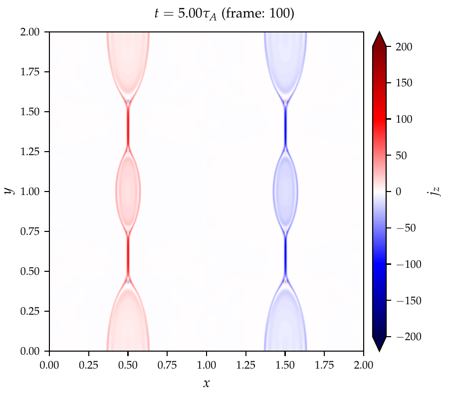

# Reconnection Simulation using Athena++
## Learning Athena++
The official documentation should the starting point: https://github.com/PrincetonUniversity/athena/wiki. You can start from the "Getting Started" section and check out the other sections once you start using the code, modifying/writing simulation decks, and adding new modules to the source code. After reading the documentation and trying the examples on your computer or a cluster, you should be able to run simulations using Athena++. In general, you need to configure the code first and then compile the code. It will generate an executable `athena` in the `bin` directory.

* A list of useful scripts: https://www.physics.unlv.edu/astro/athena2019/scripts.html

## Running reconnection simulation on Perlmutter CPU nodes @ NERSC
The reconnection deck (`code/reconnection.cpp`) is a simple double-periodic system with two current sheets. The reconnection plane is the x-y plane, and the reconnection magnetic field is along the y-direction.
* Copy `code/reconnection.cpp` to `athena/src/pgen`. Note that the problem decks should be stored in `src/pgen` in default so that the configuration script can find them.
* Create a run directory. On Perlmutter@NERSC, you should run the simulations on `$SCRATCH` instead of your `$HOME` directory. For example, `$SCRATCH/athena_reconnection_test/`.
* Copy `code/compile_reconnection.sh`, `code/athinput.reconnection`, and `code/perlmutter.batch` into `$SCRATCH/athena_reconnection_test/`.
* `compile_reconnection.sh` is a script for configuring and compiling the code.
    - Change `athena_path` to your Athena++ source code directory and `runs_backup_path` to somewhere to store the backup of the run.
    - Compile the code by `./compile_reconnection.sh`. If the script is not executable, `chmod u+x compile_reconnection.sh` first.
    - It may take up to 10 mins to compile the code. Please be patient.
* After the compiling is finished, you will find some new files in the run directory:
    - `athena`: the executable.
    - `source_xxxxxxxx_xxxxxx.tar`: the complete Athena++ source code, including the deck.
    - `modules_list` and `mdh_run_dir`: logs of the modules loaded when compiling and the run directory.
* We will request one interactive nodes to run a test and submit a Slurm job.
    - Interactive node:
        - Request an interactive node: `salloc --nodes 1 --qos interactive --time 04:00:00 --constraint cpu --account=m3122`
        - `./run_test.sh`, which will take about 40 mins to finish.
    - Slurm job:
        - `sbatch perlmutter.batch`
    - For open-boundary runs, please use `athinput.reconnection_openbc` instead. Note that it make take longer to form clear structures (e.g., islands) in the open-boundary runs.
* The code will generate a series of outputs:
    - `reconnection.*.rst`: restart files
    - `reconnection.prim.*.athdf`: primary variables.
    - `reconnection.prim.*.athdf.xdmf`: XDMF files for loading the HDF5 files into visualization softwares (e.g., ParaView or VisIt)
* There is a Jupyter notebook `code/plot_mhd_fields.ipynb` for checking the current density. In default, it will produce the 100th frame of $j_z$, which looks like

